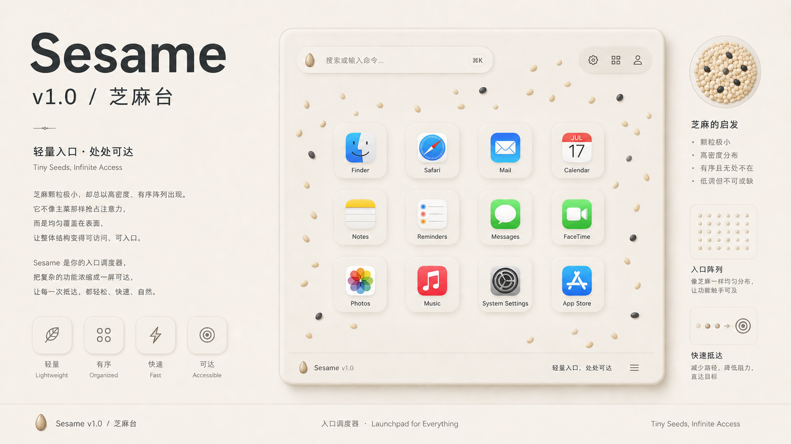

# Sesame

为 macOS 打造的键盘优先应用启动器，灵感来自 Launchpad 与 Vimium。

全屏应用网格 · 模糊搜索 · 双字母快捷启动 · 自定义分组 · 五套精挑配色 ——
全程不离开键盘。

[English](README.md) · 中文



> 芝麻颗粒极小，却总以高密度、有序阵列出现。它不像主菜那样抢占注意力，而是均匀覆盖在表面，让
> 整体结构变得可访问、可入口。Launchpad 式应用本质上是"入口调度器"——用户真正需要的不是
> 功能本身，而是快速、低阻力地抵达功能。**Sesame** 正是这种"轻量但无处不在"的界面哲学。

---

## 功能特性

### 启动与浏览
- Launchpad 风格全屏应用网格
- 自动扫描 `/Applications`、`~/Applications` 及系统应用目录
- `DispatchSource` 文件监听，应用安装/卸载实时刷新（带防抖）
- 应用图标缓存 + 异步加载

### 搜索
- 输入即过滤的实时模糊搜索
- 按首字母分区，或一键切换到**自定义分组**视图
- 在「隐藏」页可控制哪些应用出现在启动器中

### Hint 模式（招牌功能）
- 在启动器中按快捷键（默认 <kbd>⌘ K</kbd>）进入 Hint 模式
- 每个可见应用会显示一个 1-2 字母的标识
- 输入字母即刻启动 —— 不用鼠标、不用方向键

### 触发方式
- **热区触发** —— 鼠标移入屏幕任意角落（左上 / 右上 / 左下 / 右下）停留 0.24 秒
- **菜单栏图标** —— 点击状态栏图标
- **登录启动** —— 系统登录时自动唤起（可关闭）

### 个性化
- **5 套配色主题** —— 日落 / 极光 / 蜜桃 / 海洋 / 极简，
  联动改变搜索框光晕、工具按钮、背景氛围光
- **多语言** —— 中文 / English，运行时即时切换
- **字体** —— 系统默认或任一已安装字体族
- **文字大小** —— S / M / L（12 / 14 / 16pt），网格瓦片自适应重排
- **网格密度** —— 背景方格 cellSize 60–240px 可调
- **自定义快捷键** —— 录制任意修饰键组合触发 hint 模式

---

## 安装

```sh
git clone https://github.com/BlackGoldenTicked/sesame.git
cd sesame
./scripts/build_app.sh
open build/Sesame.app
```

构建脚本会执行 `swift build -c release`，打包成标准 `.app` bundle，
从 `Sources/Sesame/Resources/logo.png` 生成 `AppIcon.icns`，并写入 `Info.plist`。

把 `build/Sesame.app` 拖到 `/Applications` 即可长期使用。

**系统要求：** macOS 13+、Swift 5.9+、Xcode Command Line Tools。

---

## 使用

| 操作 | 快捷键 |
|---|---|
| 显示启动器 | 热区触发 · 菜单栏图标 · 应用聚焦时 <kbd>⌘ L</kbd> |
| 隐藏启动器 | <kbd>Esc</kbd> |
| 搜索 | 直接键入 |
| 进入 Hint 模式 | <kbd>⌘ K</kbd>（可自定义） |
| 通过 Hint 启动 | 输入应用上显示的 1-2 字母 |
| 退出 Hint 模式 | <kbd>Esc</kbd> |
| 打开设置 | 工具栏的齿轮按钮 |
| 退出应用 | 菜单聚焦时 <kbd>⌘ Q</kbd> |

热区检测在 Sesame 进程内运行，需要应用保持运行（常驻菜单栏即可）。
建议在设置中打开**登录时启动**，开机即用。

---

## 设置

Raycast 风格的侧栏布局，四个 Tab：

- **通用** —— 启动 · 语言 · 快捷键 · 主题 · 字体 · 文字大小 · 网格密度
- **隐藏** —— 可搜索的应用列表，开关式管理哪些应用显示
- **分组** —— 创建 / 编辑 / 删除命名分组
- **关于** —— 版本、版权、官网链接

---

## 技术实现

- Swift Package Manager 单体项目，零第三方依赖
- SwiftUI + AppKit 互操作（`NSWindow`、`NSStatusItem`、`NSSlider` 包装、`NSEvent` 监听）
- 设置持久化用 `UserDefaults` + JSON，支持 `v1 → v2` schema 迁移
- `ServiceManagement`（`SMAppService.mainApp`）实现登录项
- 构建脚本手动生成 `.icns` 与 bundle 结构，无需 Xcode 工程文件

### 项目结构

```
Sources/Sesame/
  main.swift               # AppDelegate、窗口管理、热区监听
  LauncherView.swift       # 全屏网格、搜索框、hint 徽章、主题
  LauncherModel.swift      # 应用列表、过滤、hint 模式状态机
  SettingsView.swift       # 侧栏设置面板（通用 / 隐藏 / 分组 / 关于）
  AppSettings.swift        # 持久化偏好 + 自适应 TileMetrics
  ColorTheme.swift         # 5 套主题配色定义
  HotkeyRecorder.swift     # 基于 NSEvent 的快捷键录制
  LaunchAtLogin.swift      # SMAppService 包装
  Localization.swift       # 中 / 英字符串字典
  ApplicationScanner.swift # 文件系统扫描 + 监听
  AppIconCache.swift       # NSWorkspace 图标缓存
  TickedSlider.swift       # 原生 NSSlider 带刻度
  HintCoordinator.swift    # 1-2 字母 hint 编码生成
  CustomGroupEditorView.swift # 拖拽式分组编辑器
scripts/build_app.sh       # 构建 + 打包 + iconset
```

---

## 待办 / Roadmap

- [ ] **优化「分组」设置页的 UI 与交互** —— 更清晰的拖拽提示、空态 / 悬停 /
  选中态、组名就地编辑、并让操作模型在数十个分组下依然顺畅。
- [ ] Spotlight / Raycast 风格的模糊排名（当前只做子串匹配）
- [ ] 快速操作插件（网页搜索、计算、剪贴板历史）
- [ ] 分组 + 隐藏列表的 iCloud 同步

欢迎贡献 —— 较大改动请先开 issue 讨论。

---

## 许可

© Chaordex Technologies Ltd. 2024–2026 版权所有。

[chaordex.com](https://www.chaordex.com)
